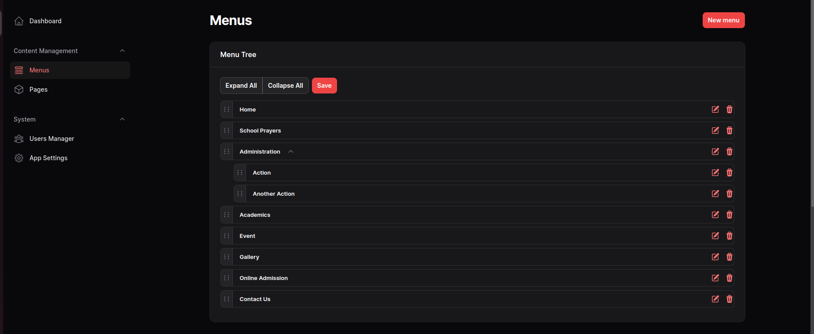
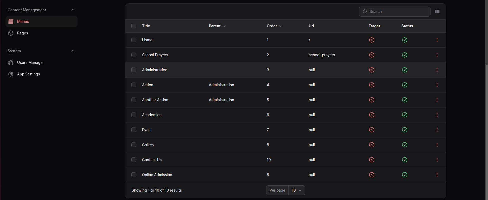

# Filament Frontend Menu

A filament package for updating frontend page menu's

## Installation

Install Using Composer

```
composer require cwsps154/filament-frontend-menu
```
Run

```
php artisan filament-frontend-menu:install
```

## Usage/Examples

Add this into your Filament `PannelProvider` class `panel()`
```
$panel->plugins([FilamentFrontendMenuPlugin::make()]);
```

You can limit the access to the resources
```
FilamentFrontendMenuPlugin::make()
                        ->canViewAny('have-access', 'view-menu')
                        ->canCreate('have-access', 'create-menu')
                        ->canEdit('have-access', 'edit-menu')
                        ->canDelete('have-access', 'delete-menu'),

```

You can publish the config file `filament-frontend-menu.php`, by running this command

```
php artisan vendor:publish --tag=filament-frontend-menu-config
```

which contains these settings

```
return [
    'layout' => null,
    'cluster' => null,
    'navigation' => [
        'group' => 'filament-frontend-menu::menu.content',
        'label' => 'filament-frontend-menu::menu.menu',
        'icon' => 'heroicon-o-queue-list',
        'sort' => 100,
    ],
    'widget' => [
        'label' => 'filament-frontend-menu::menu.widget.menu',
        'max-depth' => 2,
    ]
];
```
For More details about the widget check this package `solution-forest/filament-tree`

Using `get_menus()` you will all the menu's and it's child

## Screenshots






